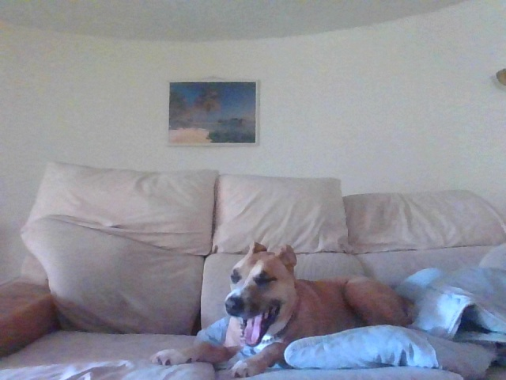
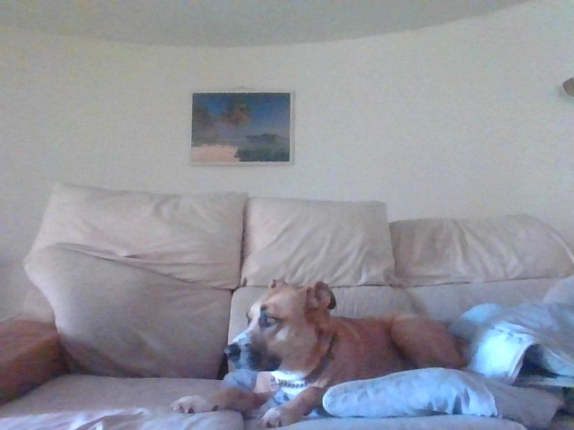

# InceptionFlow IoT Computer Vision Using Inception V3

  

## Inception V3

The Inception v3 model is a deep convolutional neural network released by Google, which has been pre-trained for the ImageNet Large Visual Recognition Challenge using data from 2012, and it can differentiate between 1,000 different classes, like “cat”, “dishwasher” or “plane”. The paper regarding Inception V3 is described in Google's Arxiv preprint ["Rethinking the Inception Architecture for Computer Vision”](https://arxiv.org/abs/1512.00567 "Rethinking the Inception Architecture for Computer Vision").

  

## InceptionFlow

InceptionFlow is an object & facial recognition Python wrapper for the Tensorflow Imagenet (Inception V3) example and integrates IoT connectivity using the TechBubble IoT JumpWay Python MQTT client.

## Object Recognition

InceptionFlow object recognition is based on the latest version of Google's Imagenet classifier example: [classify_image.py](https://github.com/tensorflow/models/blob/master/tutorials/image/imagenet/classify_image.py "classify_image.py"). 

## Included In This Tutorial

- Testing InceptionFlow Object & Facial Recognition: Looping through a local folder of random objects.
- Connecting to a local webcam.
- Connecting to an IP webcam.
- Processing the live streams for Object & Facial Recognition.
- Communicating with other devices and applications via the IoT JumpWay. 
- Facing The Open Set Recognition Issue.  

## Facial Recognition

The foundations of this project were in 2016. The project then was originally built on a [Raspberry Pi](https://iot.techbubbletechnologies.com/videos/tass-techbubble-autonomous-sight-system-videos/video/tass-inception-v3-transfer-learning-raspberry-pi "Raspberry Pi") and included inference and transfer learning being carried out locally on the Raspberry Pi locally. The Raspberry Pi version was highly accurate at detecting known people, but was vulnerable to the open set recognition issue.  

## Open Set Recognition Issue

Taken from [Walter J. Scheirer's website](https://www.wjscheirer.com/projects/openset-recognition/ "Walter J. Scheirer's website"):

 

"Both recognition and classification are common terms in computer vision. What is the difference? In classification, one assumes there is a given set of classes between which we must discriminate. For recognition, we assume there are some classes we can recognize in a much larger space of things we do not recognize. A motivating question for our work here is: What is the general object recognition problem? This question, of course, is a central theme in vision. How one should approach multi-class recognition is still an open issue. Should it be performed as a series of binary classifications, or by detection, where a search is performed for each of the possible classes? What happens when some classes are ill-sampled, not sampled at all or undefined?

The general term recognition suggests that the representation can handle different patterns often defined by discriminating features. It also suggests that the patterns to be recognized will be in general settings, visually mixed with many classes. For some problems, however, we do not need, and often cannot have, knowledge of the entire set of possible classes. For instance, in a recognition application for biologists, a single species of fish might be of interest. However, the classifier must consider the set of all other possible objects in relevant settings as potential negatives. Similarly, verification problems for security-oriented face matching constrain the target of interest to a single claimed identity, while considering the set of all other possible people as potential impostors. In addressing general object recognition, there is a finite set of known objects in myriad unknown objects, combinations and configurations - labeling something new, novel or unknown should always be a valid outcome. This leads to what is sometimes called "open set" recognition, in comparison to systems that make closed world assumptions or use "closed set" evaluation."

Both the Object & Facial recognition features of InceptionFlow are vulnerable to the Open Set Recognition issue, however it appears that object recognition is more realistic with its confidence than facial recognition is and it may be possible to fine tune the network / training data for facial recognition to attempt to improve this.

## Transfer Learning

From [Tensorflow's](https://www.tensorflow.org/tutorials/image_retraining "Tensorflow's") documentation:

"Modern object recognition models have millions of parameters and can take weeks to fully train. Transfer learning is a technique that shortcuts a lot of this work by taking a fully-trained model for a set of categories like ImageNet, and retrains from the existing weights for new classes. In this example we'll be retraining the final layer from scratch, while leaving all the others untouched. For more information on the approach you can see this paper on Decaf."

Although this tutorial is based around usage on an NVIDIA GPU, [I originally built this project on a Raspberry Pi](https://iot.techbubbletechnologies.com/videos/tass-techbubble-autonomous-sight-system-videos/video/tass-inception-v3-transfer-learning-raspberry-pi "I originally built this project on a Raspberry Pi"), so training / inference on a CPU should not be an issue. 

InceptionFlow uses transfer learning to retrain the final layer using classes, or categories, of images. This feature of the program is labelled as facial recognition throughout this tutorial, but you can actually train the network with any classes of images. 

## OS Requirements

This project has been tested in Windows 10 and Linux

## Python Requirements

This project has been tested in Python 3.5.4

## Hardware Requirements

1. NVIDIA GEFORCE GTX (Suggested for Tensorflow with GPU, tested on 750ti)

I originally created this project on a Raspberry Pi 3 so it is definitely possible to do this project without. This tutorial assumes using a GPU. To install Tensorflow on CPU or GPU, follow the relevant instructions on [Tensorflow's Installation Docs](https://www.tensorflow.org/install/ "Tensorflow's Installation Docs").

## Software requirements

1. [Tensorflow](https://www.tensorflow.org/install/ "Tensorflow")
2. [OpenCV](https://opencv.org/ "OpenCV")
3. [AdamMiltonBarker InceptionFlow](https://github.com/AdamMiltonBarker/InceptionFlow "AdamMiltonBarker InceptionFlow")
4. [TechBubbleTechnologies IoT-JumpWay-Python-MQTT-Clients](https://github.com/TechBubbleTechnologies/IoT-JumpWay-Python-MQTT-Clients "TechBubbleTechnologies IoT-JumpWay-Python-MQTT-Clients") (Installed with InceptionFlow)

## Before You Begin

There are a few tutorials that you should follow before beginning, especially if it is the first time you have used the TechBubble IoT JumpWay Developer Program. If you do not already have one, you will require a TechBubble IoT JumpWay Developer Program developer account, and some basics to be set up before you can start creating your IoT devices. Visit the following [IoT JumpWay Developer Program Docs (5-10 minute read/setup)](https://github.com/TechBubbleTechnologies/IoT-JumpWay-Docs/ "IoT JumpWay Developer Program Docs (5-10 minute read/setup)") and check out the guides that take you through registration and setting up your Location Space, Zones, Devices and Applications (About 5 minutes read).

## Installation

- Make sure you have [Tensorflow](https://www.tensorflow.org/install/"Tensorflow").
- Make sure you have [OpenCV](https://opencv.org/ "OpenCV").
- Install InceptionFlow

```
    $ pip/pip3 install InceptionFlow
```

## Cloning The Repo

You will need to clone this repository to a location on your computer. Navigate to the directory you would like to download it to and issue the following command.

```
    $ git clone https://github.com/AdamMiltonBarker/InceptionFlow.git
```

Navigate to the root of the repo on you local machine and open InceptionFlow.py, this is the example program provided to get you started.

## IoT JumpWay Application Connection Credentials & Settings

To make it possible for this project to be able to communicate with the connected camera and all IoT devices you have connected to your IoT JumpWay location, you should create an application (A future tutorial will cover connecting to a local webcam and also multiple IP cams). Now follow the [TechBubble Technologies IoT JumpWay Developer Program (BETA) Location Application Doc](https://github.com/TechBubbleTechnologies/IoT-JumpWay-Docs/blob/master/5-Location-Applications.md "TechBubble Technologies IoT JumpWay Developer Program (BETA) Location Application Doc") to set up your IoT JumpWay Location Application.

Below is the relevant configuration you need to add in data/confs.json. Update the SystemLocation, SystemApplicationID, SystemApplicationName, Cameras ID & Name (Name Optional), MQTTUsername and MQTTPassword with the details for the application you created above. Notice ClassifierSettings->MODE is set to ObjectTest, this means when the program starts it will boot into object testing mode, looping through each image in the model/testing/Objects folder.

```
    {
        "IoTJumpWaySettings": {
            "SystemLocation": YourLocationID,
            "SystemApplicationID": YourApplicationID,
            "SystemApplicationName" : "YourApplicationName",
            "SystemZone": YourZoneID,
            "SystemDeviceID": YourDeviceID,
            "SystemDeviceName" : "YourDeviceName"
        },
        "Actuators": {},
        "Cameras": [
            {
                "ID": YourCameraID,
                "URL": 0,
                "Name": "YourCameraName"
            }
        ],
        "Sensors": {},
        "IoTJumpWayMQTTSettings": {
            "MQTTUsername": "YourMQTTUsername",
            "MQTTPassword": "YourMQTTPassword"
        },
        "ClassifierSettings":{
            "MODE":"ObjectTest",
            "INCEPTION_SIZE":299,  
            "OBJECT_THRESHOLD": 0.5,
            "FACIAL_THRESHOLD": 0.9965,
            "HAAR_SCALE_FACTOR": 1.3,
            "HAAR_MIN_NEIGHBORS":4,
            "HAAR_FACES": "Haarcascades/haarcascade_frontalface_default.xml",
            "HAAR_FACES": "Haarcascades/haarcascade_frontalface_default.xml",
            "HAAR_FACES2": "Haarcascades/haarcascade_frontalface_alt.xml",
            "HAAR_FACES3": "Haarcascades/haarcascade_frontalface_alt2.xml",
            "HAAR_PROFILES": "Haarcascades/haarcascade_profileface.xml",
            "HAAR_SMILE": "Haarcascades/haarcascade_smile.xml",
            "HAAR_EYE": "Haarcascades/haarcascade_eye.xml",
            "height":112,
            "width": 92
        }
    }
```

## Testing InceptionFlow Object Recognition

The first excercise once you are set up is to test the default object recognition functionality.

On line 144 of InceptionFlow.py and onwards, you will notice that once the program is initiated it loops continually checking what mode the program is in. In this case we are in ObjectTest so we hit line 154 which initiates objectTesting. 

When you are in the root of the repo, issue the following command:

```
    $ python InceptionFlow.py
```

With a threshold of 0.5 running on Tensorflow CPU on Windows, the following identifications were made.

```
TESTING OBJECTS

FILE: cropped_panda.jpg

TOP PREDICTIONS:
giant panda, panda, panda bear, coon bear, Ailuropoda melanoleuca (score = 0.89632)
indri, indris, Indri indri, Indri brevicaudatus (score = 0.00766)
lesser panda, red panda, panda, bear cat, cat bear, Ailurus fulgens (score = 0.00266)
custard apple (score = 0.00138)
earthstar (score = 0.00104)


^^^IDENTIFIED^^^
PROVIDED IMAGE: cropped_panda.jpg
OBJECT DETECTED: giant panda, panda, panda bear, coon bear, Ailuropoda melanoleuca
CONFIDENCE: 0.8963184
...

FILE: house.jpg

TOP PREDICTIONS:
mobile home, manufactured home (score = 0.41764)
boathouse (score = 0.36377)
Norfolk terrier (score = 0.00815)
Airedale, Airedale terrier (score = 0.00674)
lakeside, lakeshore (score = 0.00337)

FILE: mars-rover.jpg

TOP PREDICTIONS:
warplane, military plane (score = 0.60562)
projectile, missile (score = 0.10552)
missile (score = 0.05302)
wing (score = 0.01513)
cannon (score = 0.00897)


^^^IDENTIFIED^^^
PROVIDED IMAGE: mars-rover.jpg
OBJECT DETECTED: warplane, military plane
CONFIDENCE: 0.605617
...

FILE: moon.jpg

TOP PREDICTIONS:
bubble (score = 0.16346)
saltshaker, salt shaker (score = 0.09212)
tick (score = 0.05572)
jellyfish (score = 0.04658)
ladle (score = 0.01820)

COMPLETED TESTING OBJECTS
2 IDENTIFIED OBJECTS
...

COMPLETING TESTING OBJECTS

TESTING DEACTIVATED

```

As mentioned previously, with object detection the confidences are more realistic so with a good threshold it is fairly accurate.

## InceptionFlow Realtime Camera Object Recognition

Update data/confs.json -> ClassifierSettings -> MODE to ObjectCam, this will set the program to capture the local webcam and process it for objects it knows.

On lines 47 and onwards in InceptionFlow.py, you see that the program connects to the primary webcam on your computer. 

If the program identifies an object, it sends a notification to the IoT JumpWay.

### Using An IP Camera

You can easily connect to an IP cam by changing the URL field in data/confs.json to the URL of your IP camera. If you are not using an IP camera you should leave it as 0 (zero).

```
	"Cameras": [
		{
			"ID": YourCameraID,
			"URL": "YourIPCameraURL",
			"Name": "YourCameraName"
		}
	]
```

### LIVE TESTING

 With a threshold of 0.5, the following identifications were made in a live environment (Cherrypicked).
 
 
 
```
InceptionFlow\InceptionFlow/data/captures/2018-01-28/13/01-04.jpg

TOP PREDICTIONS:
whippet (score = 0.80831)
Italian greyhound (score = 0.05006)
quilt, comforter, comfort, puff (score = 0.03492)
studio couch, day bed (score = 0.02149)
mosquito net (score = 0.00331)

Object: whippet
Confidence: 0.808311

Published to Device Sensors Channel
Published: 37
```
 
 

```
InceptionFlow\InceptionFlow/data/captures/2018-01-28/13/01-13.jpg

TOP PREDICTIONS:
studio couch, day bed (score = 0.68807)
boxer (score = 0.06134)
quilt, comforter, comfort, puff (score = 0.05531)
pillow (score = 0.05483)
American Staffordshire terrier, Staffordshire terrier, American pit bull terrier, pit bull terrier (score = 0.04028)

Object: studio couch, day bed
Confidence: 0.68807167

Published to Device Sensors Channel
Published: 38
```

```
InceptionFlow\InceptionFlow/data/captures/2018-01-28/13/00-07.jpg

TOP PREDICTIONS:
studio couch, day bed (score = 0.55105)
quilt, comforter, comfort, puff (score = 0.21434)
whippet (score = 0.08104)
pillow (score = 0.02408)
boxer (score = 0.01519)

Object: studio couch, day bed
Confidence: 0.5510519

Published to Device Sensors Channel
Published: 32
InceptionFlow\InceptionFlow/data/captures/2018-01-28/13/00-15.jpg

TOP PREDICTIONS:
whippet (score = 0.28307)
studio couch, day bed (score = 0.23136)
quilt, comforter, comfort, puff (score = 0.20973)
Italian greyhound (score = 0.02032)
redbone (score = 0.01729)

NOTHING IDENTIFIED

InceptionFlow\InceptionFlow/data/captures/2018-01-28/13/00-24.jpg

TOP PREDICTIONS:
quilt, comforter, comfort, puff (score = 0.28841)
studio couch, day bed (score = 0.22828)
American Staffordshire terrier, Staffordshire terrier, American pit bull terrier, pit bull terrier (score = 0.10877)
boxer (score = 0.05448)
whippet (score = 0.04049)

NOTHING IDENTIFIED

InceptionFlow\InceptionFlow/data/captures/2018-01-28/13/00-32.jpg

TOP PREDICTIONS:
whippet (score = 0.82170)
studio couch, day bed (score = 0.11359)
quilt, comforter, comfort, puff (score = 0.01984)
borzoi, Russian wolfhound (score = 0.00535)
pillow (score = 0.00404)

Object: whippet
Confidence: 0.82170016

Published to Device Sensors Channel
Published: 33
```

## Preparing Training Data For Your Facial Recognition Neural Network

Create 1 or more folders in the model/training/Facial directory, these folders will represent classes, and there should be 1 folder / class (person), name the folder using something that will allow you identify who the photos are of, the name of the folder / class will be used by the program to let you know who it has detected. You can use names, user IDs or anything you like for the folder / class names, but bear in mind privacy. We have successfully tested with 30 training images per class, but your application may need more or less than this. You will need at least 2 classes to begin training.

## Training Your Facial Recognition Neural Network

Now you have added your training data, you should train your neural network. Update data/confs.json -> ClassifierSettings -> MODE to FacialTrain, this will set the program to training mode.

Then execute the program to begin training:

```
    $ python InceptionFlow.py
```

Once the training completes, you should see output like the following:

```
2018-01-27 23:16:21.275019: Step 3998: Train accuracy = 100.0%
2018-01-27 23:16:21.275502: Step 3998: Cross entropy = 0.001254
2018-01-27 23:16:21.353860: Step 3998: Validation accuracy = 100.0%
2018-01-27 23:16:21.444547: Step 3999: Train accuracy = 100.0%
2018-01-27 23:16:21.444646: Step 3999: Cross entropy = 0.001331
2018-01-27 23:16:21.523840: Step 3999: Validation accuracy = 100.0%
Final test accuracy = 100.0%
Converted 2 variables to const ops.
TRAINING COMPLETED
```

Training is now complete.

## Viewing Your Data  

The data stored in the [TechBubble IoT JumpWay](https://iot.techbubbletechnologies.com/ "TechBubble IoT JumpWay") has come from a sensor, your camera.  Find your device in the in the [TechBubble IoT JumpWay Developers Area](https://iot.techbubbletechnologies.com/developers/dashboard/ "TechBubble IoT JumpWay Developers Area") and then visit the Sensors Data page to view the data sent from your device. As the communication has been sent from the InceptionFlow application, you will not see device status as the device did not actually connect to the JumpWay. 

## InceptionFlow Bugs & Issues

Please feel free to create issues for bugs and general issues you come across whilst using this project. For issues with using the IoT JumpWay please visit the TechBubble GitHub repo.

## InceptionFlow Contributors

- [Adam Milton-Barker, TechBubble Technologies Founder](https://github.com/AdamMiltonBarker "Adam Milton-Barker, TechBubble Technologies Founder")

 