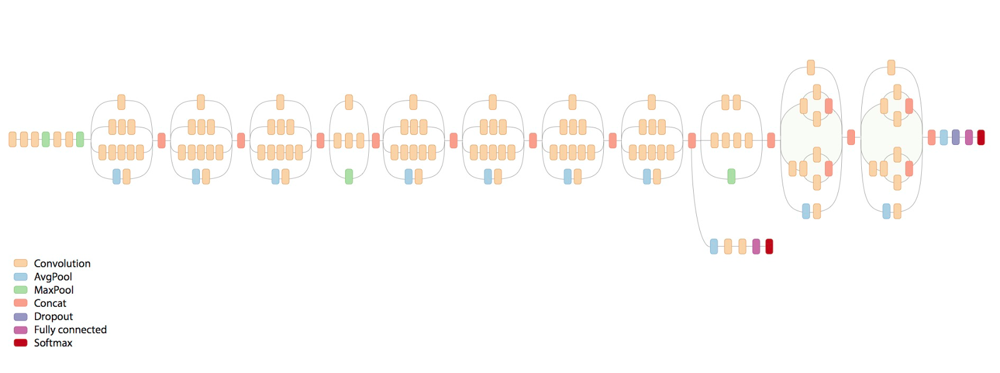

# InceptionFlow IoT Computer Vision Using Inception V3

  

## Inception V3

The Inception v3 model is a deep convolutional neural network released by Google, which has been pre-trained for the ImageNet Large Visual Recognition Challenge using data from 2012, and it can differentiate between 1,000 different classes, like “cat”, “dishwasher” or “plane”. The paper regarding Inception V3 is described in Google's Arxiv preprint ["Rethinking the Inception Architecture for Computer Vision”](https://arxiv.org/abs/1512.00567 "Rethinking the Inception Architecture for Computer Vision").

  

## InceptionFlow

InceptionFlow is an object & facial recognition Python wrapper for the Tensorflow Imagenet example and integrates IoT connectivity using the TechBubble IoT JumpWay Python MQTT client.

## Object Recognition

InceptionFlow object recognition is based on the latest version of Google's Imagenet classifier example: [classify_image.py](https://github.com/tensorflow/models/blob/master/tutorials/image/imagenet/classify_image.py "classify_image.py"). 

This tutorial will include:

- Testing InceptionFlow Object Recognition: Looping through local folder of random objects.
- Connecting to a local webcam.
- Communicating with other devices and applications via the IoT JumpWay.  

## Facial Recognition

I originally developed the facial recognition part of this project in 2016. The project then was built on a [Raspberry Pi](https://iot.techbubbletechnologies.com/videos/tass-techbubble-autonomous-sight-system-videos/video/tass-inception-v3-transfer-learning-raspberry-pi "Raspberry Pi") and included inference and transfer learning of the model being carried out locally on the Raspberry Pi itself. The Raspberry Pi version was highly accurate at detecting known people, but was vulnerable to the open set recognition issue.  

## Transfer Learning

From [Tensorflow's](https://www.tensorflow.org/tutorials/image_retraining "Tensorflow's") documentation:

"Modern object recognition models have millions of parameters and can take weeks to fully train. Transfer learning is a technique that shortcuts a lot of this work by taking a fully-trained model for a set of categories like ImageNet, and retrains from the existing weights for new classes. In this example we'll be retraining the final layer from scratch, while leaving all the others untouched. For more information on the approach you can see this paper on Decaf."

Although this tutorial is based around usage on an NVIDIA GPU, [I originally built this project on a Raspberry Pi](https://iot.techbubbletechnologies.com/videos/tass-techbubble-autonomous-sight-system-videos/video/tass-inception-v3-transfer-learning-raspberry-pi "I originally built this project on a Raspberry Pi"), so training / inference on a CPU should not be an issue. 

## Open Set Recognition Issue

Taken from [Walter J. Scheirer's website](https://www.wjscheirer.com/projects/openset-recognition/ "Walter J. Scheirer's website"):

 

"Both recognition and classification are common terms in computer vision. What is the difference? In classification, one assumes there is a given set of classes between which we must discriminate. For recognition, we assume there are some classes we can recognize in a much larger space of things we do not recognize. A motivating question for our work here is: What is the general object recognition problem? This question, of course, is a central theme in vision. How one should approach multi-class recognition is still an open issue. Should it be performed as a series of binary classifications, or by detection, where a search is performed for each of the possible classes? What happens when some classes are ill-sampled, not sampled at all or undefined?

The general term recognition suggests that the representation can handle different patterns often defined by discriminating features. It also suggests that the patterns to be recognized will be in general settings, visually mixed with many classes. For some problems, however, we do not need, and often cannot have, knowledge of the entire set of possible classes. For instance, in a recognition application for biologists, a single species of fish might be of interest. However, the classifier must consider the set of all other possible objects in relevant settings as potential negatives. Similarly, verification problems for security-oriented face matching constrain the target of interest to a single claimed identity, while considering the set of all other possible people as potential impostors. In addressing general object recognition, there is a finite set of known objects in myriad unknown objects, combinations and configurations - labeling something new, novel or unknown should always be a valid outcome. This leads to what is sometimes called "open set" recognition, in comparison to systems that make closed world assumptions or use "closed set" evaluation."

## Hardware Requirements

1. NVIDIA GEFORCE GTX (Suggested for Tensorflow with GPU, tested on 750ti)

I originally created this project on a Raspberry Pi 3 so it is definitely possible to do this project without. This tutorial assumes using a GPU. To install Tensorflow on CPU or GPU, follow the relevant instructions on [Tensorflow's Installation Docs](https://www.tensorflow.org/install/ "Tensorflow's Installation Docs").

## Software requirements

1. [Tensorflow](https://www.tensorflow.org/install/"Tensorflow")
2. [AdamMiltonBarker InceptionFlow](https://github.com/AdamMiltonBarker/InceptionFlow "AdamMiltonBarker InceptionFlow")
3. [TechBubbleTechnologies IoT-JumpWay-Python-MQTT-Clients](https://github.com/TechBubbleTechnologies/IoT-JumpWay-Python-MQTT-Clients "TechBubbleTechnologies IoT-JumpWay-Python-MQTT-Clients") (Installed with InceptionFlow)

## Before You Begin

There are a few tutorials that you should follow before beginning, especially if it is the first time you have used the TechBubble IoT JumpWay Developer Program. If you do not already have one, you will require a TechBubble IoT JumpWay Developer Program developer account, and some basics to be set up before you can start creating your IoT devices. Visit the following [IoT JumpWay Developer Program Docs (5-10 minute read/setup)](https://github.com/TechBubbleTechnologies/IoT-JumpWay-Docs/ "IoT JumpWay Developer Program Docs (5-10 minute read/setup)") and check out the guides that take you through registration and setting up your Location Space, Zones, Devices and Applications (About 5 minutes read).

## Installation

- Make sure you have [Tensorflow](https://www.tensorflow.org/install/"Tensorflow") installed, the latest version should work.
- Install InceptionFlow

```
    $ pip/pip3 install InceptionFlow
```

## Cloning The Repo

You will need to clone this repository to a location on your computer. Navigate to the directory you would like to download it to and issue the following command.

```
    $ git clone https://github.com/AdamMiltonBarker/InceptionFlow.git
```

Navigate to the root of the repo on you local machine and open InceptionFlow.py, this is the example program provided to get you started.

## IoT JumpWay Application Connection Credentials & Settings

To make it possible for this project to be able to communicate with the connected camera and all IoT devices you have connected to your IoT JumpWay location, you should create an application (A future tutorial will cover connecting to a local webcam and also multiple IP cams). Now follow the [TechBubble Technologies IoT JumpWay Developer Program (BETA) Location Application Doc](https://github.com/TechBubbleTechnologies/IoT-JumpWay-Docs/blob/master/5-Location-Applications.md "TechBubble Technologies IoT JumpWay Developer Program (BETA) Location Application Doc") to set up your IoT JumpWay Location Application.

Below is the relevant configuration you need to add in data/confs.json. Update the SystemLocation, SystemApplicationID, SystemApplicationName, Cameras ID & Name (Name Optional), MQTTUsername and MQTTPassword with the details for the application you created above:

```
	"IoTJumpWaySettings": {
        "SystemLocation": YourLocationID,
        "SystemApplicationID": YourApplicationID,
        "SystemApplicationName" : "YourApplicationName",
        "SystemZone": YourZoneID,
        "SystemDeviceID": YourDeviceID,
        "SystemDeviceName" : "YourDeviceName"
    },
	"Actuators": {},
	"Cameras": [
		{
			"ID": YourCameraID,
			"Name": "YourCameraName"
		}
	],
	"Sensors": {},
	"IoTJumpWayMQTTSettings": {
        "MQTTUsername": "YourMQTTUsername",
        "MQTTPassword": "YourMQTTPassword"
    }
```

## Testing InceptionFlow Object Recognition

The first excercise once you are set up is to test the default object recognition functionality. You will notice on line 31 of InceptionFlow.py, the variable self.Test is set to True, this means that the program is in testing mode. 

On line 94 and onwards, you will notice that once the program is initiated it loops continually checking if Test or Train are set to True else then checks what mode the program is in for camera monitoring. In this case we are interested in Test. As the program is currently in testing mode, this area is reached and the testing() function is called which loops through some random images and attempts to detect them. 

When you are in the root of the repo, issue the following command:

```
    $ python InceptionFlow.py
```

On my machine, here is the outcome:

```
FILE: house.jpg
TOP PREDICTIONS:
boathouse (score = 0.43377)
mobile home, manufactured home (score = 0.34660)
Norfolk terrier (score = 0.00728)
Airedale, Airedale terrier (score = 0.00597)
lakeside, lakeshore (score = 0.00408)

PROVIDED IMAGE: house.jpg
OBJECT DETECTED: boathouse
CONFIDENCE: 0.4337674
...

FILE: moon.jpg
I tensorflow/core/common_runtime/gpu/gpu_device.cc:975] Creating TensorFlow device (/gpu:0) -> (device: 0, name: GeForce GTX 750 Ti, pci bus id: 0000:01:00.0)
TOP PREDICTIONS:
bubble (score = 0.16346)
saltshaker, salt shaker (score = 0.09212)
tick (score = 0.05572)
jellyfish (score = 0.04658)
ladle (score = 0.01820)

PROVIDED IMAGE: moon.jpg
OBJECT DETECTED: bubble
CONFIDENCE: 0.16346219
...

FILE: cropped_panda.jpg
I tensorflow/core/common_runtime/gpu/gpu_device.cc:975] Creating TensorFlow device (/gpu:0) -> (device: 0, name: GeForce GTX 750 Ti, pci bus id: 0000:01:00.0)
TOP PREDICTIONS:
giant panda, panda, panda bear, coon bear, Ailuropoda melanoleuca (score = 0.89107)
indri, indris, Indri indri, Indri brevicaudatus (score = 0.00779)
lesser panda, red panda, panda, bear cat, cat bear, Ailurus fulgens (score = 0.00296)
custard apple (score = 0.00147)
earthstar (score = 0.00117)

PROVIDED IMAGE: cropped_panda.jpg
OBJECT DETECTED: giant panda, panda, panda bear, coon bear, Ailuropoda melanoleuca
CONFIDENCE: 0.89107335
...

FILE: mars-rover.jpg
I tensorflow/core/common_runtime/gpu/gpu_device.cc:975] Creating TensorFlow device (/gpu:0) -> (device: 0, name: GeForce GTX 750 Ti, pci bus id: 0000:01:00.0)
TOP PREDICTIONS:
warplane, military plane (score = 0.53739)
projectile, missile (score = 0.10449)
missile (score = 0.05537)
wing (score = 0.01747)
cannon (score = 0.01235)

PROVIDED IMAGE: mars-rover.jpg
OBJECT DETECTED: warplane, military plane
CONFIDENCE: 0.5373875
...

COMPLETING TESTING OBJECTS

TESTING DEACTIVATED

```

## InceptionFlow Realtime Camera Object Recognition

Once the testing stage has completed, Test will be set to false and the loop will continue onto the camera processing. On lines 46 and onwards in InceptionFlow.py, you see that the program connects to the primary webcam on your computer. Further on you will also be shown how to connect to a webcam. 

In the main part of the script, now that Test has finished, the program checks what mode it is in. By default the program is set to ObjectLocal. The program continues to check the webcam feed for an object and processes them to guess what objects they are.

If the program identifies an object, it sends a notification to the IoT JumpWay.

### EXAMPLE FRAME

 On my system, the quality from the camera is not amazing due to it being night time. The camera is detecting something, below you will see a frame from the camera and a selection of the output from the program from that frame onwards. The program clearly thinks that it has identified a crate and it also identifies a lamp, although there are two lamps in the frame I am interested to see the results tomorrow in the daylight. 

 

### OUTPUT

```
/home/genisys/Desktop/InceptionFlow/InceptionFlow/images/2018-01-27/20/32-15.jpg
I tensorflow/core/common_runtime/gpu/gpu_device.cc:975] Creating TensorFlow device (/gpu:0) -> (device: 0, name: GeForce GTX 750 Ti, pci bus id: 0000:01:00.0)

TOP PREDICTIONS:
crate (score = 0.16082)
wardrobe, closet, press (score = 0.08356)
table lamp (score = 0.07620)
lampshade, lamp shade (score = 0.06619)
desk (score = 0.05752)

Object: crate
Confidence: 0.16081852

Published to Device Sensors Channel
Published: 2

/home/genisys/Desktop/InceptionFlow/InceptionFlow/images/2018-01-27/20/32-21.jpg
I tensorflow/core/common_runtime/gpu/gpu_device.cc:975] Creating TensorFlow device (/gpu:0) -> (device: 0, name: GeForce GTX 750 Ti, pci bus id: 0000:01:00.0)

TOP PREDICTIONS:
crate (score = 0.26500)
lampshade, lamp shade (score = 0.05366)
table lamp (score = 0.03618)
desk (score = 0.03610)
wardrobe, closet, press (score = 0.03102)

Object: crate
Confidence: 0.26500276

Published to Device Sensors Channel
Published: 3

/home/genisys/Desktop/InceptionFlow/InceptionFlow/images/2018-01-27/20/32-27.jpg
I tensorflow/core/common_runtime/gpu/gpu_device.cc:975] Creating TensorFlow device (/gpu:0) -> (device: 0, name: GeForce GTX 750 Ti, pci bus id: 0000:01:00.0)

TOP PREDICTIONS:
crate (score = 0.22588)
wardrobe, closet, press (score = 0.06275)
dining table, board (score = 0.05320)
lampshade, lamp shade (score = 0.04917)
table lamp (score = 0.03575)

Object: crate
Confidence: 0.22588398

Published to Device Sensors Channel
Published: 4

/home/genisys/Desktop/InceptionFlow/InceptionFlow/images/2018-01-27/20/32-32.jpg
I tensorflow/core/common_runtime/gpu/gpu_device.cc:975] Creating TensorFlow device (/gpu:0) -> (device: 0, name: GeForce GTX 750 Ti, pci bus id: 0000:01:00.0)

TOP PREDICTIONS:
crate (score = 0.12352)
table lamp (score = 0.10036)
wardrobe, closet, press (score = 0.08558)
lampshade, lamp shade (score = 0.06495)
desk (score = 0.04919)

Object: crate
Confidence: 0.12352495

Published to Device Sensors Channel
Published: 5

/home/genisys/Desktop/InceptionFlow/InceptionFlow/images/2018-01-27/20/32-38.jpg
I tensorflow/core/common_runtime/gpu/gpu_device.cc:975] Creating TensorFlow device (/gpu:0) -> (device: 0, name: GeForce GTX 750 Ti, pci bus id: 0000:01:00.0)

TOP PREDICTIONS:
table lamp (score = 0.11011)
crate (score = 0.09420)
lampshade, lamp shade (score = 0.08453)
wardrobe, closet, press (score = 0.06316)
desk (score = 0.04722)

Object: table lamp
Confidence: 0.11010705

```

## Viewing Your Data  

The data stored in the [TechBubble IoT JumpWay](https://iot.techbubbletechnologies.com/ "TechBubble IoT JumpWay") has come from a sensor, your camera.  Find your device in the in the [TechBubble IoT JumpWay Developers Area](https://iot.techbubbletechnologies.com/developers/dashboard/ "TechBubble IoT JumpWay Developers Area") and then visit the Sensors Data page to view the data sent from your device. As the communication has been sent from the InceptionFlow application, you will not see device status as the device did not actually connect to the JumpWay. 

## InceptionFlow Bugs & Issues

Please feel free to create issues for bugs and general issues you come across whilst using this project. For issues with using the IoT JumpWay please visit the TechBubble GitHub repo.

## InceptionFlow Contributors

- [Adam Milton-Barker, TechBubble Technologies Founder](https://github.com/AdamMiltonBarker "Adam Milton-Barker, TechBubble Technologies Founder")

 