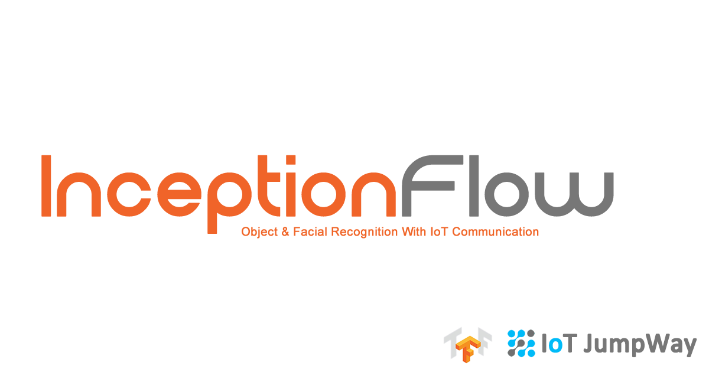

# InceptionFlow IoT Computer Vision Using Inception V3

  

## Inception V3

The Inception v3 model is a deep convolutional neural network released by Google, which has been pre-trained for the ImageNet Large Visual Recognition Challenge using data from 2012, and it can differentiate between 1,000 different classes, like “cat”, “dishwasher” or “plane”. The paper regarding Inception V3 is described in Google's Arxiv preprint ["Rethinking the Inception Architecture for Computer Vision”](https://arxiv.org/abs/1512.00567 "Rethinking the Inception Architecture for Computer Vision").

  

## Object Recognition

InceptionFlow object recognition is based on the latest version of Google's Imagenet classifier example: [classify_image.py](https://github.com/tensorflow/models/blob/master/tutorials/image/imagenet/classify_image.py "classify_image.py"). 

This tutorial will include:

- Testing InceptionFlow Object Recognition: Looping through local folder of random objects.
- Connecting to a local webcam.
- Communicating with other devices and applications via the IoT JumpWay.  

## Facial Recognition

COMING SOON! 

## Hardware Requirements

1. NVIDIA GEFORCE GTX (Suggested for Tensorflow with GPU, tested on 750ti)

I originally created this project on a Raspberry Pi 3 so it is definitely possible to do this project without. This tutorial assumes using a GPU. To install Tensorflow on CPU or GPU, follow the relevant instructions on [Tensorflow's Installation Docs](https://www.tensorflow.org/install/ "Tensorflow's Installation Docs").

## Software requirements

1. [Tensorflow](https://www.tensorflow.org/install/"Tensorflow")
2. [AdamMiltonBarker InceptionFlow](https://github.com/AdamMiltonBarker/InceptionFlow "AdamMiltonBarker InceptionFlow")
3. [TechBubbleTechnologies IoT-JumpWay-Python-MQTT-Clients](https://github.com/TechBubbleTechnologies/IoT-JumpWay-Python-MQTT-Clients "TechBubbleTechnologies IoT-JumpWay-Python-MQTT-Clients") (Installed with InceptionFlow)

## Before You Begin

There are a few tutorials that you should follow before beginning, especially if it is the first time you have used the TechBubble IoT JumpWay Developer Program. If you do not already have one, you will require a TechBubble IoT JumpWay Developer Program developer account, and some basics to be set up before you can start creating your IoT devices. Visit the following [IoT JumpWay Developer Program Docs (5-10 minute read/setup)](https://github.com/TechBubbleTechnologies/IoT-JumpWay-Docs/ "IoT JumpWay Developer Program Docs (5-10 minute read/setup)") and check out the guides that take you through registration and setting up your Location Space, Zones, Devices and Applications (About 5 minutes read).

## Installation

- Make sure you have [Tensorflow](https://www.tensorflow.org/install/"Tensorflow") installed, the latest version should work.
- Install InceptionFlow

```
    $ pip/pip3 install InceptionFlow
```

## Cloning The Repo

You will need to clone this repository to a location on your computer. Navigate to the directory you would like to download it to and issue the following command.

```
    $ git clone https://github.com/AdamMiltonBarker/InceptionFlow.git
```

Navigate to the root of the repo on you local machine and open InceptionFlow.py, this is the example program provided to get you started.

## IoT JumpWay Application Connection Credentials & Settings

To make it possible for this project to be able to communicate with the connected camera and all IoT devices you have connected to your IoT JumpWay location, you should create an application (A future tutorial will cover connecting to a local webcam and also multiple IP cams). Now follow the [TechBubble Technologies IoT JumpWay Developer Program (BETA) Location Application Doc](https://github.com/TechBubbleTechnologies/IoT-JumpWay-Docs/blob/master/5-Location-Applications.md "TechBubble Technologies IoT JumpWay Developer Program (BETA) Location Application Doc") to set up your IoT JumpWay Location Application.

Below is the relevant configuration you need to add in data/confs.json. Update the SystemLocation, SystemZone:

```
	"IoTJumpWaySettings": {
        "SystemLocation": YourLocationID,
        "SystemApplicationID": YourApplicationID,
        "SystemApplicationName" : "YourApplicationName",
        "SystemZone": YourZoneID,
        "SystemDeviceID": YourDeviceID,
        "SystemDeviceName" : "YourDeviceName"
    },
	"Sensors": {},
	"Actuators": {},
	"IoTJumpWayMQTTSettings": {
        "MQTTUsername": "YourMQTTUsername",
        "MQTTPassword": "YourMQTTPassword"
    }
```

## Testing InceptionFlow Object Recognition

The first excercise once you are set up is to test the default object recognition functionality. You will notice on line 22 of InceptionFlow.py, the variable self.Test is set to True, this means that the program is in testing mode. 

On line 84 you will notice that once the program is initiated it loops continually checking if Test or Train are set to True, in this case we are interested in Test. As the program is currently in testing mode, this area is reached and the testing() function is called which loops through some random images and attempts to detect them. 

When you are in the root of the repo, issue the following command:

```
    $ python InceptionFlow.py
```

On my machine, here is the outcome:

```
LOCATED MODEL LABELS
IMAGE: house.jpg
OBJECT: boathouse
Confidence: 0.4337674

FILE: moon.jpg
I tensorflow/core/common_runtime/gpu/gpu_device.cc:975] Creating TensorFlow device (/gpu:0) -> (device: 0, name: GeForce GTX 750 Ti, pci bus id: 0000:01:00.0)
LOCATED MODEL LABELS
IMAGE: moon.jpg
OBJECT: bubble
Confidence: 0.16346219

FILE: cropped_panda.jpg
I tensorflow/core/common_runtime/gpu/gpu_device.cc:975] Creating TensorFlow device (/gpu:0) -> (device: 0, name: GeForce GTX 750 Ti, pci bus id: 0000:01:00.0)
LOCATED MODEL LABELS
IMAGE: cropped_panda.jpg
OBJECT: giant panda, panda, panda bear, coon bear, Ailuropoda melanoleuca
Confidence: 0.8910735

FILE: mars-rover.jpg
I tensorflow/core/common_runtime/gpu/gpu_device.cc:975] Creating TensorFlow device (/gpu:0) -> (device: 0, name: GeForce GTX 750 Ti, pci bus id: 0000:01:00.0)
LOCATED MODEL LABELS
IMAGE: mars-rover.jpg
OBJECT: warplane, military plane
Confidence: 0.5373875


COMPLETING TESTING OBJECTS
TESTING DEACTIVATED
```

## InceptionFlow Bugs & Issues

Please feel free to create issues for bugs and general issues you come across whilst using this project. For issues with using the IoT JumpWay please visit the TechBubble GitHub repo.

## InceptionFlow Contributors

- [Adam Milton-Barker, TechBubble Technologies Founder](https://github.com/AdamMiltonBarker "Adam Milton-Barker, TechBubble Technologies Founder")

 